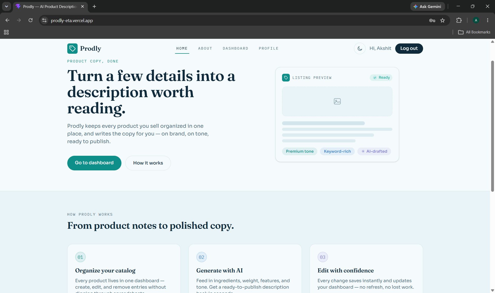
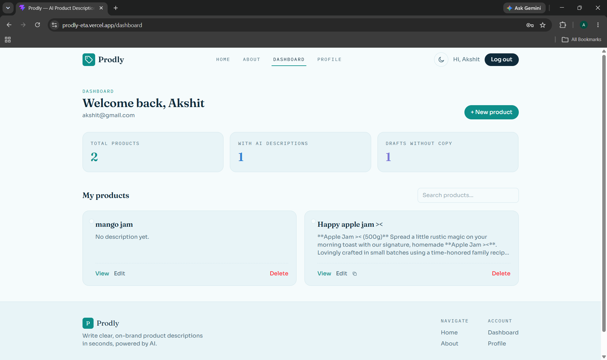
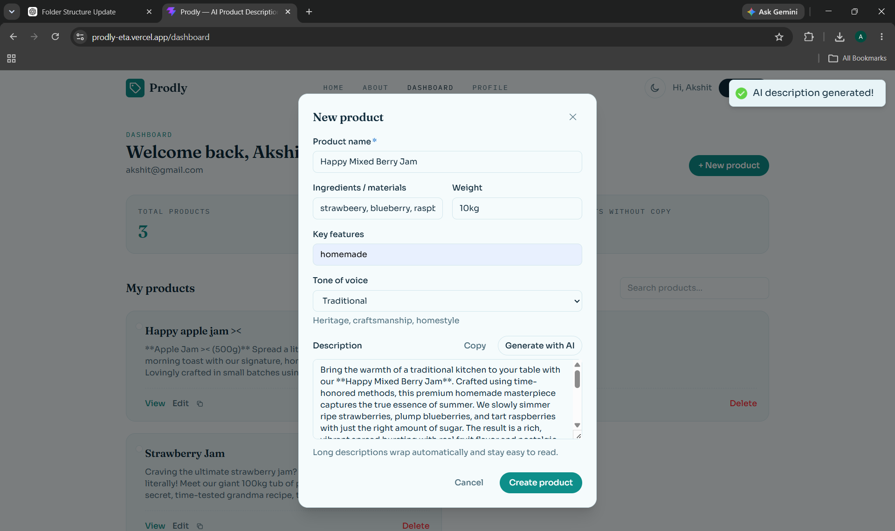
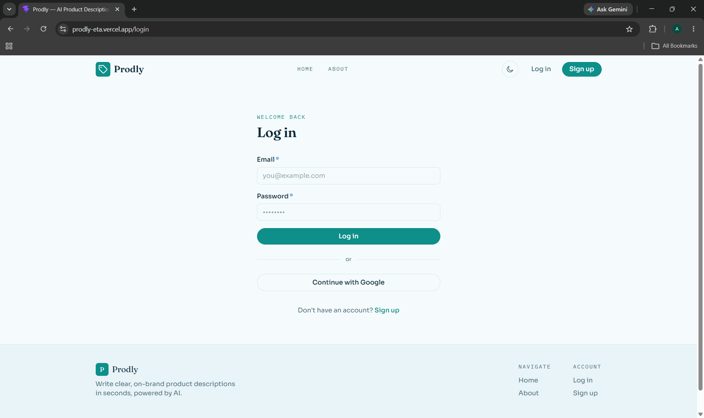
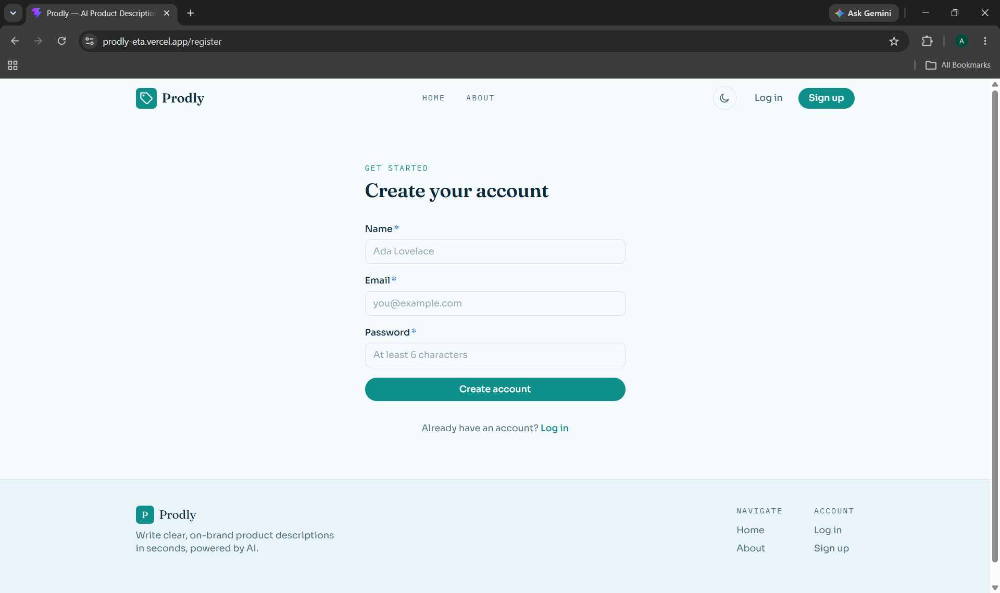

# Prodly

An AI-powered product description generator that helps users create, manage, and improve product descriptions using Google Gemini AI.

## Live Demo

- **Frontend:** https://prodly-eta.vercel.app/
- **Backend API:** https://prodly.onrender.com/

## Demo Video

**YouTube Unlisted:** To be added after recording.

## 📸 Screenshots

### Home Page



### Dashboard



### AI Feature



### Login Page



### Sigup Page




## Features

- User registration with input validation
- Secure password hashing using bcrypt
- JWT-based authentication
- Google OAuth login using Passport.js
- Protected routes for authenticated users
- Guest-only routes for login and registration
- Personalized user profile and account management
- Create product records
- View and search user-specific products
- View individual product details
- Edit existing products
- Delete products and user accounts
- AI-powered product description generation using Google Gemini
- Loading states for API and AI operations
- Toast notifications for success and error states
- Empty states when no products are available
- Responsive UI for mobile, tablet, and desktop
- Light/dark theme support
- React Error Boundary for graceful frontend error handling
- RESTful Express backend API
- Backend request validation and rate limiting

## Tech Stack

### Frontend

- React 19
- Vite
- Tailwind CSS 4
- React Router DOM
- Axios
- React Hot Toast

### Backend

- Node.js
- Express 5
- Passport.js
- Passport Google OAuth 2.0
- JWT (`jsonwebtoken`)
- bcrypt
- express-validator
- express-rate-limit
- CORS
- dotenv

### Database

- MongoDB
- MongoDB Atlas
- Mongoose

### AI

- Google Gemini API
- `@google/genai`

### Deployment

- Vercel for the frontend
- Render for the backend
- MongoDB Atlas for the database

## Project Architecture

Prodly is organized as a monorepo with two independently runnable applications:

- `frontend/` contains the React/Vite client application.
- `backend/` contains the Express REST API, authentication, database integration, and Gemini AI integration.
- The root `README.md` documents the complete project.
- `PROMPTS.md` contains AI-development prompts used during the project.

The repository's current structure is:

```text
Prodly/
├── .gitignore
├── PROMPTS.md
├── README.md
│
├── backend/
│   ├── .env.example
│   ├── .gitignore
│   ├── .gitkeep
│   ├── package.json
│   ├── package-lock.json
│   ├── server.js
│   ├── testGemini.js
│   │
│   ├── config/
│   │   ├── db.js
│   │   └── passport.js
│   │
│   ├── controllers/
│   │   ├── aiController.js
│   │   ├── authController.js
│   │   └── productController.js
│   │
│   ├── middleware/
│   │   ├── authMiddleware.js
│   │   ├── rateLimitMiddleware.js
│   │   └── validationMiddleware.js
│   │
│   ├── models/
│   │   ├── Product.js
│   │   └── User.js
│   │
│   └── routes/
│       ├── aiRoutes.js
│       ├── authRoutes.js
│       └── productRoutes.js
│
└── frontend/
    ├── .gitignore
    ├── README.md
    ├── eslint.config.js
    ├── index.html
    ├── package.json
    ├── package-lock.json
    ├── vercel.json
    ├── vite.config.js
    │
    ├── public/
    │   ├── favicon.svg
    │   └── icons.svg
    │
    └── src/
        ├── App.jsx
        ├── index.css
        ├── main.jsx
        │
        ├── api/
        │   ├── authApi.js
        │   └── productApi.js
        │
        ├── assets/
        │   ├── hero.png
        │   ├── react.svg
        │   └── vite.svg
        │
        ├── components/
        │   ├── Card.jsx
        │   ├── ErrorBoundary.jsx
        │   ├── Footer.jsx
        │   ├── GuestRoute.jsx
        │   ├── Hero.jsx
        │   ├── Navbar.jsx
        │   ├── ProductForm.jsx
        │   ├── ProtectedRoute.jsx
        │   │
        │   ├── layout/
        │   │   └── Layout.jsx
        │   │
        │   └── ui/
        │       ├── Button.jsx
        │       ├── Input.jsx
        │       ├── Loader.jsx
        │       ├── Modal.jsx
        │       ├── Toast.jsx
        │       └── index.js
        │
        ├── context/
        │   ├── AuthContext.jsx
        │   ├── ThemeContext.jsx
        │   ├── authContextObject.js
        │   ├── themeContextObject.js
        │   ├── useAuth.js
        │   └── useTheme.js
        │
        └── pages/
            ├── About.jsx
            ├── Dashboard.jsx
            ├── Home.jsx
            ├── Login.jsx
            ├── NotFound.jsx
            ├── OAuthSuccess.jsx
            ├── ProductDetail.jsx
            ├── Profile.jsx
            └── Register.jsx
```

### Frontend Structure Explained

| Directory / File | Purpose |
|---|---|
| `src/api/` | Axios-based functions for communicating with backend endpoints |
| `src/assets/` | Local frontend assets and images |
| `src/components/` | Reusable application components and route guards |
| `src/components/layout/` | Shared page layout components |
| `src/components/ui/` | Reusable UI building blocks such as buttons, inputs, modals, loaders, and toast helpers |
| `src/context/` | Authentication and theme state/context utilities |
| `src/pages/` | Route-level page components |
| `App.jsx` | Frontend routing and protected/guest route configuration |
| `main.jsx` | React application entry point |
| `index.css` | Global styles and Tailwind CSS configuration |

### Backend Structure Explained

| Directory / File | Purpose |
|---|---|
| `config/` | Database and Passport authentication configuration |
| `controllers/` | Business logic for authentication, products, and AI generation |
| `middleware/` | Authentication, validation, and rate-limiting middleware |
| `models/` | Mongoose database models for users and products |
| `routes/` | REST API route definitions |
| `server.js` | Express application setup, middleware, route mounting, and server startup |
| `testGemini.js` | Local Gemini API testing utility |

## Application Flow

```text
                    ┌──────────────────────────┐
                    │   React + Vite Frontend   │
                    │                          │
                    │ Pages / Components       │
                    │ Context / Axios          │
                    └────────────┬─────────────┘
                                 │
                           HTTP + JWT
                                 │
                                 ▼
                    ┌──────────────────────────┐
                    │     Express REST API     │
                    │                          │
                    │ Authentication           │
                    │ Product CRUD             │
                    │ Validation / Rate Limit  │
                    │ AI Generation            │
                    └───────┬─────────┬────────┘
                            │         │
                            │         └─────────────────┐
                            ▼                           ▼
                 ┌──────────────────┐       ┌──────────────────┐
                 │   MongoDB Atlas  │       │   Google Gemini  │
                 │                  │       │       API        │
                 │ Users / Products │       │ AI descriptions  │
                 └──────────────────┘       └──────────────────┘
```

## Authentication Flow

### Email / Password

```text
Register / Login
       │
       ▼
Express validation
       │
       ▼
bcrypt password handling
       │
       ▼
JWT generated
       │
       ▼
Frontend stores authentication state
       │
       ▼
Protected API requests use Bearer JWT
```

### Google OAuth

```text
Frontend
   │
   ▼
GET /api/auth/google
   │
   ▼
Google OAuth consent
   │
   ▼
/api/auth/google/callback
   │
   ▼
Backend creates JWT
   │
   ▼
Frontend /oauth-success
```

## Setup Instructions

### Prerequisites

- Node.js LTS
- npm
- MongoDB Atlas account or a MongoDB instance
- Google Gemini API key
- Google Cloud OAuth credentials if Google login is required

### 1. Clone the Repository

```bash
git clone https://github.com/cr-netizen/Prodly.git
cd Prodly
```

### 2. Install Backend Dependencies

```bash
cd backend
npm install
```

### 3. Configure Backend Environment Variables

Create a `.env` file inside `backend/`.

Use `backend/.env.example` as the template:

```env
PORT=5000
MONGO_URI=your_mongodb_connection_string
JWT_SECRET=your_jwt_secret
GEMINI_API_KEY=your_gemini_api_key
FRONTEND_URL=http://localhost:5173
GOOGLE_CLIENT_ID=your_google_client_id
GOOGLE_CLIENT_SECRET=your_google_client_secret
GOOGLE_CALLBACK_URL=http://localhost:5000/api/auth/google/callback
```

Never commit real secrets or `.env` files to GitHub.

### 4. Start the Backend

```bash
npm run dev
```

The backend runs locally at:

```text
http://localhost:5000
```

API base URL:

```text
http://localhost:5000/api
```

### 5. Install Frontend Dependencies

Open another terminal from the repository root:

```bash
cd frontend
npm install
```

### 6. Configure Frontend Environment Variables

Create:

```text
frontend/.env
```

Add:

```env
VITE_API_URL=http://localhost:5000
```

### 7. Start the Frontend

```bash
npm run dev
```

The frontend runs locally at:

```text
http://localhost:5173
```

### 8. Production Environment Variables

For Vercel:

```env
VITE_API_URL=https://prodly.onrender.com
```

For Render, configure backend environment variables in the Render dashboard. Do not commit production secrets to the repository.

For Google OAuth in production, the Google Cloud OAuth client must allow the deployed callback URL:

```text
https://prodly.onrender.com/api/auth/google/callback
```

## API Documentation

### Base URLs

Local:

```text
http://localhost:5000/api
```

Production:

```text
https://prodly.onrender.com/api
```

### Authentication Endpoints

| Method | Endpoint | Auth | Purpose |
|---|---|---|---|
| `POST` | `/auth/register` | No | Register a new user |
| `POST` | `/auth/login` | No | Login with email and password |
| `GET` | `/auth/me` | Yes | Get the current authenticated user |
| `DELETE` | `/auth/me` | Yes | Delete the current user account |
| `GET` | `/auth/google` | No | Start Google OAuth login |
| `GET` | `/auth/google/callback` | No | Handle Google OAuth callback |

### Product Endpoints

All product endpoints require:

```http
Authorization: Bearer JWT_TOKEN
```

| Method | Endpoint | Purpose |
|---|---|---|
| `GET` | `/products` | Get products belonging to the authenticated user |
| `GET` | `/products/search?q=strawberry` | Search the authenticated user's products |
| `GET` | `/products/:id` | Get one product |
| `POST` | `/products` | Create a product |
| `PUT` | `/products/:id` | Update a product |
| `DELETE` | `/products/:id` | Delete a product |

### AI Endpoint

```http
POST /ai/generate-description
```

Example request:

```json
{
  "productName": "Organic Strawberry Jam",
  "ingredients": "Strawberries, sugar",
  "weight": "250g",
  "features": "Organic and homemade",
  "tone": "Friendly"
}
```

Example response:

```json
{
  "description": "A delicious AI-generated product description..."
}
```

## Database Schema

### User

The `User` model stores authentication and profile information.

Typical fields include:

- Name
- Email
- Password hash
- Google OAuth identifier where applicable

### Product

The `Product` model stores product-description data and associates each product with its owner.

Typical fields include:

- Product name
- Ingredients
- Weight
- Features
- Tone
- Generated description
- User reference

The user reference ensures product data is scoped to the authenticated user.

## Security

Prodly includes several basic security measures:

- Password hashing with bcrypt
- JWT authentication for protected resources
- Protected frontend routes
- Backend authentication middleware
- Request validation using `express-validator`
- Authentication rate limiting using `express-rate-limit`
- Environment variables for secrets
- CORS configuration
- User-specific product access

### Current Security Considerations

JWT authentication currently relies on browser-side storage/state, so the application should be hardened further before use in a high-security production environment. In particular, HttpOnly secure cookies and stronger CSRF protections would be preferable to storing long-lived tokens in browser-accessible storage.

## Deployment

### Frontend

The React/Vite application is deployed on Vercel:

https://prodly-eta.vercel.app/

### Backend

The Express API is deployed on Render:

https://prodly.onrender.com/

### Database

MongoDB Atlas provides the hosted MongoDB database used by the backend.

## Scripts

### Frontend

```bash
npm run dev       # Start Vite development server
npm run build     # Create production build
npm run lint      # Run ESLint
npm run preview   # Preview production build locally
```

### Backend

```bash
npm run dev       # Start backend with nodemon
npm start         # Start backend with Node.js
```

## Known Limitations

- The project uses free-tier deployment services.
- Render's free tier may spin down after inactivity, so the first API request after idle time can be slower.
- AI generation depends on Gemini API availability, quotas, and rate limits.
- Google OAuth requires correct callback URLs in both local and production environments.
- JWT-based browser authentication should be hardened further for security-sensitive deployments.
- Production deployment configuration depends on environment variables that are intentionally not stored in the repository.
- The final demo video link will be added after recording.
- Screenshots will be added to this README after the final UI capture.

## Credits & Acknowledgements

- Google Gemini API for AI-powered product description generation
- MongoDB Atlas for hosted database infrastructure
- Vercel for frontend deployment
- Render for backend deployment
- React, Vite, Express, Tailwind CSS, Mongoose, Passport.js, and related open-source libraries
- ChatGPT and GitHub Copilot for AI-assisted development and debugging
- Learning resources and documentation referenced during development

## License

This project is currently maintained as an internship/capstone project. No separate open-source license has been specified.
